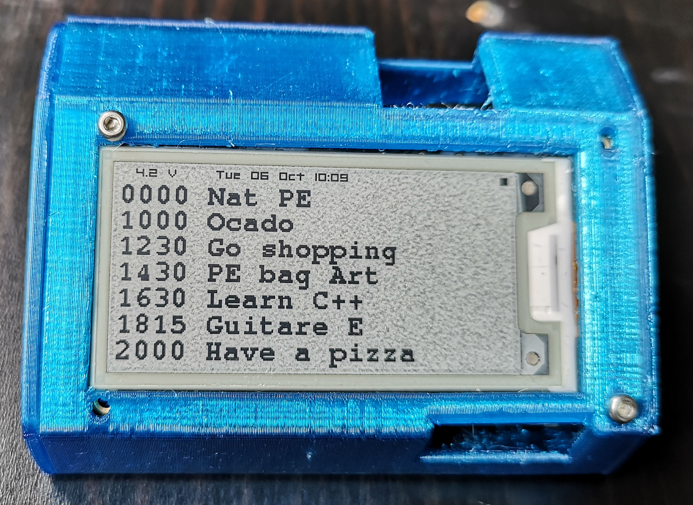
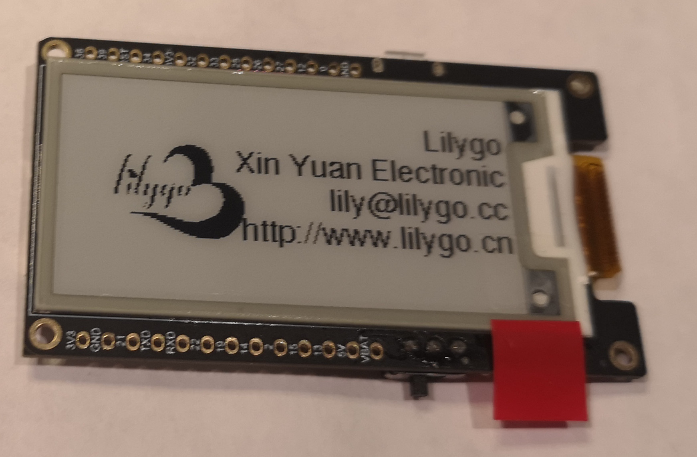
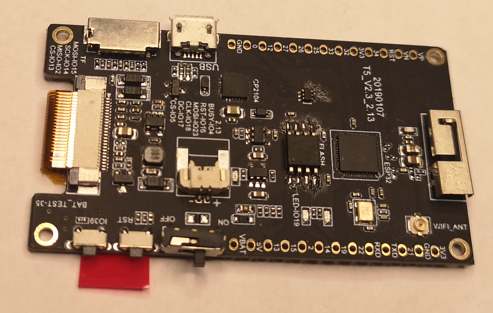

# e-paper-calendar
Simple ESP32 run ePaper board, displaying daily appointments from a Google Calendar

See it in action: https://youtu.be/xnUqWcdtqyU

More details about the project: https://trandi.wordpress.com/epaper-calendar

Final result:

The ESP32 board used:

